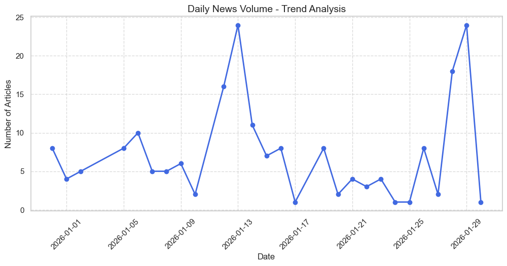
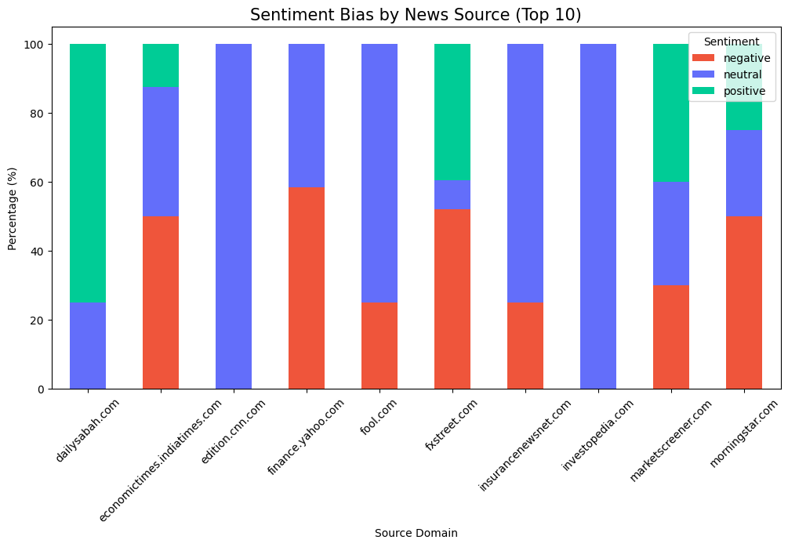

# 📊 Economic News NLP Dashboard: Market Sentiment Intelligence

## 🎯 Project Overview
This project is an end-to-end Data Science pipeline designed to monitor and analyze global economic narratives in real-time. By leveraging the **GDELT Project API**, the system ingests thousands of headlines to detect market sentiment shifts using **FinBERT**, a state-of-the-art NLP model specialized for financial contexts.

The goal is to provide a "Macro Pulse" that helps analysts identify emerging economic trends before they hit traditional indicators.

---

## 🏗️ Architecture & Pipeline
The project follows a modular architecture to ensure reproducibility and clean code standards:

1.  **Data Ingestion (`src/ingest.py`)**: Automated retrieval of global economic news using boolean queries.
2.  **Preprocessing (`src/preprocess.py`)**: Data cleaning, deduplication, and feature engineering (source and country extraction).
3.  **NLP Analysis (`src/nlp_analysis.py`)**: Batch inference using **FinBERT** for sentiment classification (Positive, Negative, Neutral).
4.  **Interactive Dashboard (`app/main.py`)**: A real-time UI built with **Streamlit** and **Plotly** for data exploration.

---

## 📈 Visual Insights & EDA

### 1. Interactive AI Dashboard
The main interface allows users to filter by date, source, and **Model Confidence Score**, ensuring that only high-certainty predictions are analyzed.


### 2. Temporal Sentiment Trends
Analysis of how the economic narrative evolves daily. This helps in identifying specific dates where "Negative" news peaks, often correlating with market volatility.



### 3. Source Bias Detection
A descriptive analysis of which news outlets are most active and their dominant sentiment, revealing potential institutional biases in economic reporting.



---

## 🚀 Getting Started

### Prerequisites
* Python 3.9+
* A virtual environment (`venv` or `conda`)

### Installation
1. **Clone the repository**:
   ```bash
   git clone [https://github.com/your-username/economic-news-nlp.git](https://github.com/your-username/economic-news-nlp.git)
   cd economic-news-nlp
2. **Install Dependencies**
    ```bash
    pip install -r requirements.txt
3. **Run the full pipeline**
   ```bash
   python src/ingest.py
   python src/preprocess.py
   python src/nlp_analysis.py
4. **Launch the Dashboard**
   ```bash   
   streamlit run app/main.py
## 🛠️ Tech Stack
* **Core:** Python 3.x

* **NLP:** Hugging Face Transformers (FinBERT), PyTorch.

* **Data:** Pandas, GDELT API.

* **Visualization:** Plotly, Seaborn, Matplotlib.

* **Frontend:** Streamlit (with Custom CSS for accessibility).

## 💡 Key Findings
**Model Precision:** FinBERT effectively distinguishes between general "negativity" and financial "bearishness", providing higher accuracy than generic models.

**Source Concentration:** The EDA revealed that a small number of global sources dominate the economic narrative, emphasizing the need for multi-source validation
